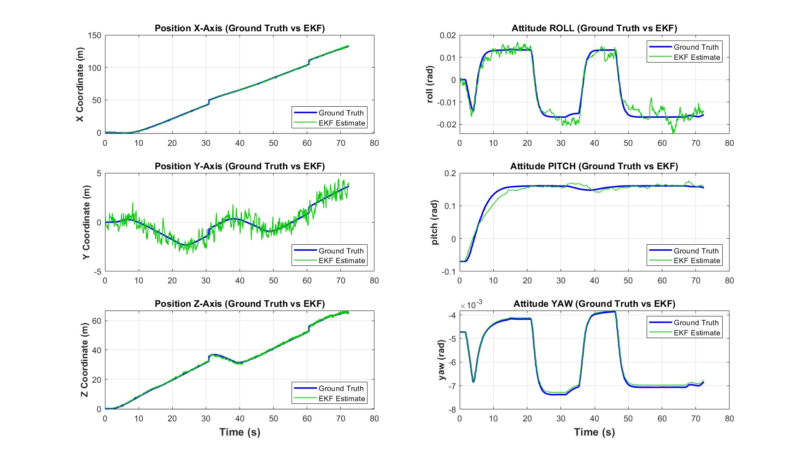
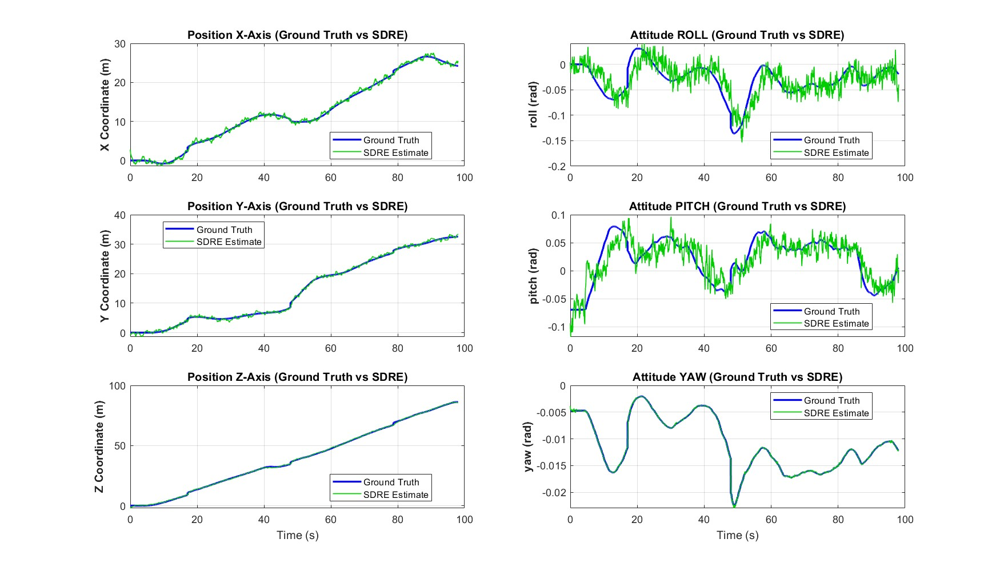
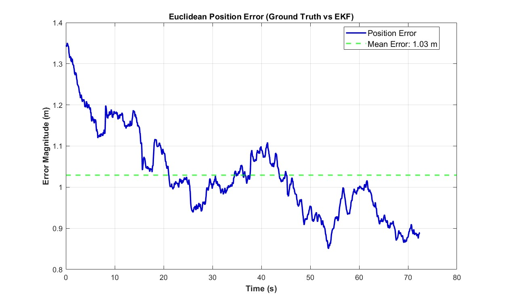
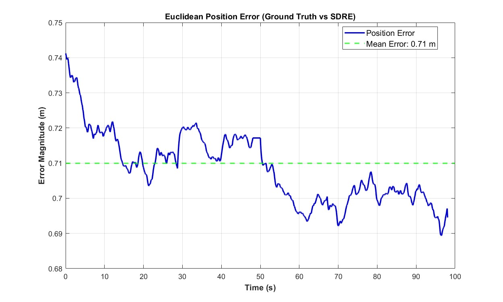
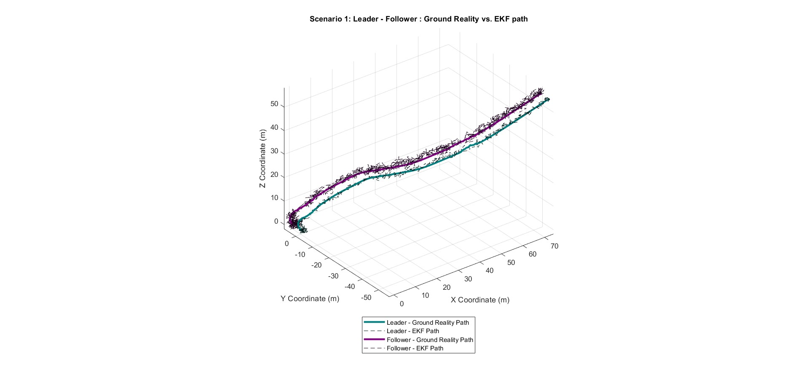
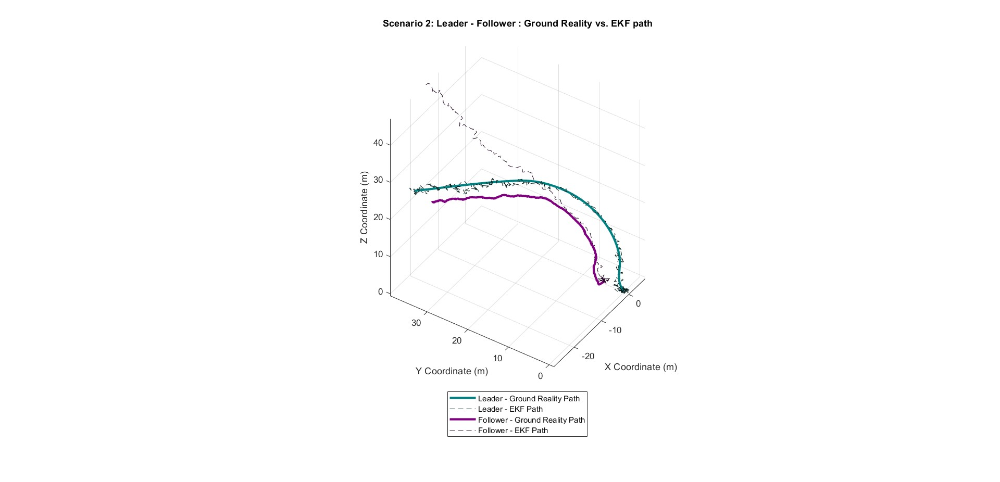
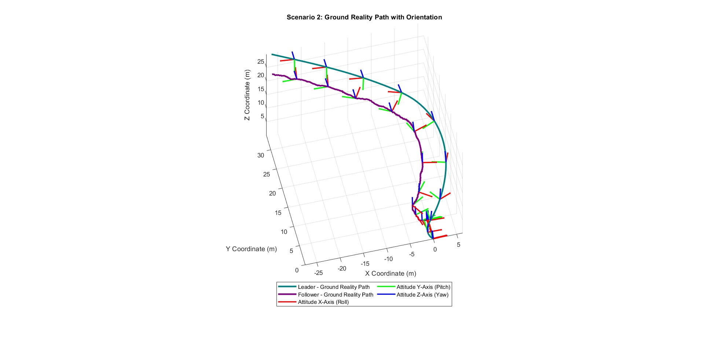

# UAV Navigation in GPS-Denied Environment using Webots and ROS 2

This repository contains the simulation framework and source code for the Master's Thesis: **"Cooperative UAV Navigation in GPS-Denied Environments Using ROS2 and Webots Simulation"**

The project implements a **Leader-Follower** architecture where a follower drone(No GPS) autonomously tracks and follows a moving leader drone(GPS) without relying on Global Positioning Data. Instead, it fuses onboard Inertial Measurement Unit (IMU) data with relative visual estimates (Camera (YOLO) + LiDAR) to perform cooperative localization and nonlinear optimal control.

## 🚀 Key Features

* **Simulation Environment:** Developed a high-fidelity physics simulation using Webots and ROS 2 (Humble) middleware to model complex drone dynamics.
* **Computer Vision:** Integrated YOLOv8 for real-time object detection to robustly identify and track the leader drone within the camera frame.
* **State Estimator:** Designed and implemented custom Extended Kalman Filter (EKF) and State-Dependent Riccati Equation (SDRE) filters to fuse high-rate IMU data with low-rate relative position measurements.
* **Sensor Fusion:** Implemented multi-sensor fusion (Camera/YOLOv8 + LiDAR) to estimate the leader’s relative position within the follower's local coordinate system, enabling precise distance maintenance (Formation Flying).
* **Cooperative Localization and Navigation:** Validated the framework in two distinct operational scenarios:
*    **Scenario 1:** Active V2V communication where the Leader transmits its GPS coordinates. The follower computes a "Pseudo-GPS" position by combining relative sensor data with the leader's global position.
*    **Scenatio 2:** Operates without communication or global references. The follower maintains formation solely relying on onboard sensor fusion for relative navigation, validating autonomy in GPS-denied environments.

## 📊 Results

The framework was tested in scenarios involving curved paths and continuous turning.
* **Tracking Accuracy:** Achieved precise leader-follower formation by maintaining a fixed relative distance via robust Vision & LiDAR sensor fusion.
* **Disturbance Rejection:** Validated EKF and SDRE filters, demonstrating effective active noise rejection and stable state estimation during flight.
*  **Scenario 1 (Active Communication):** In this scenario, the Leader drone actively transmits its own global GPS position to the Follower drone at a low frequency. Since the Follower lacks its own GPS access, it fuses this received global data with its locally measured relative position (derived from Camera + LiDAR fusion). By adding the relative vector to the Leader's global coordinates, the Follower generates a "Pseudo-GPS" signal, allowing its estimator to determine its global position in the world frame.
*  **Scenario 2 (Non Communcation):** In this scenario, there is no communication between the drones. The Follower relies entirely on its onboard Camera + LiDAR fusion to track the Leader's relative position within its own local coordinate frame. Consequently, the estimator operates in dead-reckoning mode, maintaining formation solely based on local relative state estimates without any global reference.

The comparison graphs below illustrate the performance of the EKF and SDRE estimators on state estimation.
| Extended Kalman Filter | State Dependent Riccat-Equation Filter |
| :---: | :---: |
|  |  |
| *EKF vs Ground truth for Position and Attitude* | *SDRE filter vs Ground truth for Position and Attitude* |

The graph below compares the Euclidean distance error between the estimated positions and the ground truth for both the EKF and SDRE filters.
| Extended Kalman Filter | State Dependent Riccat-Equation Filter |
| :---: | :---: |
|  |  |
| *Euclidean distance error for EKF* | *Euclidean distance error for SDRE* |


The graphs below compare the 3D position trajectories generated by the state estimators in both scenarios.
| Scenario 1: Active Communication | Scenario 2: Non- Communication |
| :---: | :---: |
|  |  |
| *3D trajectory of leader and follower drone, effect of Communication (Pseudo-GPS)* | *3D trajectory of leader and follower drone, effect of No Communication (dead-reckoning mode)* |

The graphs below illustrate the orientation profiles of both drones. A critical observation is that the Follower drone consistently maintains its heading towards the Leader in both scenarios. This alignment validates the precision of the sensor fusion algorithm, which provides accurate data to the controller and ensures the Leader remains within the Follower's camera field of view. This demonstrates that even in the absence of GPS or any communication, the Follower drone achieves robust navigation solely by maintaining visual contact with the Leader.
| Scenario 1: Active Communication | Scenario 2: Non- Communication |
| :---: | :---: |
|  |  |
| *Orientation of Leader and Follower drone* | *Orientation of Leader and Follower drone* |
---

## 📂 Repository Structure

The project is organized as a ROS 2 workspace:

* **`src/mavic2_webots/`**: Contains the simulation assets.
    * `worlds/`: The simulation environments.
    * `controllers/`: Webots controllers.
    * `protos/`: Custom drone models.
* **`src/mavic2_ekf_pkg/`**: The core ROS 2 package.
    * `launch/`: Launch files to start the simulation and nodes.
    * `mavic2_ekf_pkg/`: Python source code for nodes (Logger, EKF, etc.).

## 🛠️ Prerequisites

* **OS:** Ubuntu 22.04.5 LTS
* **ROS 2:** Humble
* **Webots:** R2024b (or newer)
* **Object Detection Algorithm:** YOLOv8 (You Only Look Once Version 8)
* **ros-webots-bridge:** `ros-humble-webots-ros2`

## ⚙️ Installation

### 1. Install Webots
The recommended way is to use the official Cyberbotics APT repository. Run the following commands:

```bash
# Add the Cyberbotics repository
sudo mkdir -p /etc/apt/keyrings
cd /etc/apt/keyrings
sudo wget -q [https://cyberbotics.com/Cyberbotics.asc](https://cyberbotics.com/Cyberbotics.asc)
echo "deb [arch=amd64 signed-by=/etc/apt/keyrings/Cyberbotics.asc] [https://cyberbotics.com/debian](https://cyberbotics.com/debian) binary-amd64/" | sudo tee /etc/apt/sources.list.d/Cyberbotics.list

# Update and install
sudo apt update
sudo apt install webots
```

### 2. **Install ROS 2 Humble**
```bash
# Set locale
locale  # check for UTF-8

sudo apt update && sudo apt install locales
sudo locale-gen en_US en_US.UTF-8
sudo update-locale LC_ALL=en_US.UTF-8 LANG=en_US.UTF-8
export LANG=en_US.UTF-8

# Setup Sources
sudo apt install software-properties-common
sudo add-apt-repository universe
sudo apt update && sudo apt install curl -y
sudo curl -sSL [https://raw.githubusercontent.com/ros2/ros2/master/ros2.repos](https://raw.githubusercontent.com/ros2/ros2/master/ros2.repos) -o /tmp/ros2.repos # This line is often handled by adding the key manually, simpler version below:

# Authorize ROS 2 GPG Key
sudo curl -sSL [https://raw.githubusercontent.com/ros/rosdistro/master/ros.key](https://raw.githubusercontent.com/ros/rosdistro/master/ros.key) -o /usr/share/keyrings/ros-archive-keyring.gpg
echo "deb [arch=$(dpkg --print-architecture) signed-by=/usr/share/keyrings/ros-archive-keyring.gpg] [http://packages.ros.org/ros2/ubuntu](http://packages.ros.org/ros2/ubuntu) $(lsb_release -cs) main" | sudo tee /etc/apt/sources.list.d/ros2.list > /dev/null

# Install ROS 2 Humble Desktop
sudo apt update
sudo apt install ros-humble-desktop
sudo apt install ros-dev-tools
```

### 3.  **Install Webots-ROS2 Bridge**
```bash
sudo apt install ros-humble-webots-ros2
```

### 4.  **Clone the repository:**
```bash
git clone [https://github.com/SkyShankar/UAV-Navigation-in-GPS-Denied-Environment-using-Webots-and-ROS2.git](https://github.com/SkyShankar/UAV-Navigation-in-GPS-Denied-Environment-using-Webots-and-ROS2.git)
```

### 5.  **Navigate to the workspace:**
```bash
cd UAV-Navigation-in-GPS-Denied-Environment-using-Webots-and-ROS2
```

### 6.  **Install dependencies for ROS2 and YOLOv8:**
```bash
sudo rosdep init
rosdep update

rosdep install --from-paths src --ignore-src -r -y

pip3 install ultralytics # YOLOv8 Library
```

### 7.  **Build the workspace:**
```bash
colcon build --symlink-install
```

### 8.  **Source the setup file:**
```bash
source install/setup.bash
```

## ▶️ Usage

To launch the simulation and the EKF nodes:

```bash
webots ~<webots_file_location>.wbt
ros2 launch mavic2_ekf_pkg <launch_file_location>.py


